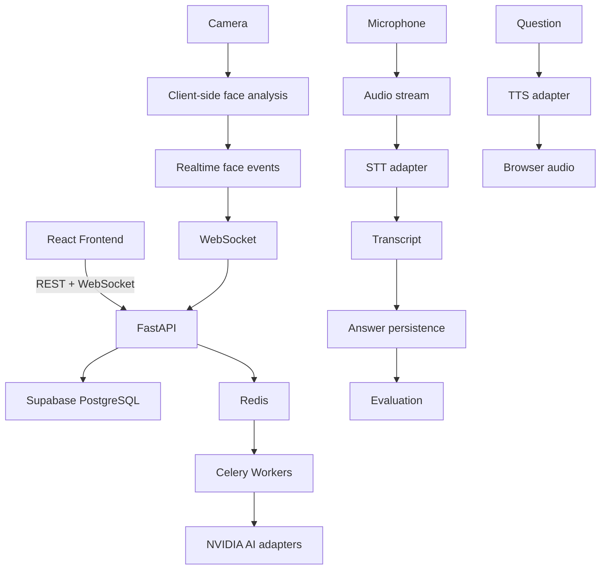

# AI Interview Preparation System

## Project Overview

AI Interview Preparation System is a realtime, AI-powered interview preparation platform rather than a static questionnaire website. A candidate can create an account, upload a resume, configure an interview, start a server-authoritative realtime session, exchange spoken questions and answers, receive transcription and evaluation events, continue through contextual follow-ups, and review a final performance report.

The current repository contains the React frontend, FastAPI backend, database migrations, Celery pipeline, AI provider interfaces, realtime WebSocket transport, tests, and technical documentation. External services such as PostgreSQL, Redis, provider APIs, and hosted storage still require environment-specific configuration and live verification.

## Problem Statement

Conventional interview practice usually relies on static questions, has no resume-aware personalization, lacks realtime spoken interaction, provides limited feedback, and does not preserve a continuous interview lifecycle from preparation through evaluation and reporting.

## Proposed Solution

The system combines AI question generation and evaluation with resume processing, speech adapters, realtime WebSocket communication, a server-authoritative interview state machine, asynchronous workers, and contextual follow-up generation. The backend owns durable state and authorization while the browser owns media capture and presentation.

## Major Features

- JWT authentication, refresh-token rotation, logout, and ownership checks.
- Resume upload and asynchronous processing through the storage and worker interfaces.
- Role, interview type, difficulty, persona, language, and question-count configuration.
- AI-backed question generation, answer evaluation, follow-up decisions, and report generation.
- Realtime sessions over WebSocket with reconnect support and bounded heartbeats/events.
- Browser camera and microphone integration through compact face-status and audio events; raw frames are not persisted.
- Speech-to-text and text-to-speech provider adapters, including NVIDIA speech integration seams.
- Idempotent answer submission shared by REST and realtime transcript flows.
- Interview transcript, persisted evaluations, history, and performance reports.

## System Architecture



The intended runtime chain is React -> REST/WebSocket -> FastAPI -> PostgreSQL, with Redis and Celery providing asynchronous work and NVIDIA adapters providing configured AI capabilities. The repository also supports local development with the included PostgreSQL and Redis Compose services.

## Technology Stack

**Frontend:** React, Vite, React Router, TanStack Query, React Hook Form, Zod, browser media APIs, and a face-event contract suitable for client-side analysis such as MediaPipe.

**Backend:** Python, FastAPI, SQLAlchemy, Alembic, Pydantic, JWT authentication, and WebSockets.

**Infrastructure:** PostgreSQL, Supabase-compatible PostgreSQL and Storage, Redis, Celery, and Docker Compose.

**AI:** Provider abstraction for LLM, speech-to-text, text-to-speech, evaluation, follow-up, and report generation, with NVIDIA LLM and speech/NIM/Riva adapters where configured.

## Backend Architecture

- **API layer:** FastAPI REST and WebSocket routes under `/api/v1`.
- **Service layer:** authentication, interview lifecycle, resume, evaluation, follow-up, and report services.
- **State machine:** `app.interviews.state_machine` validates every interview transition server-side.
- **Database layer:** SQLAlchemy models and Alembic migrations own durable state.
- **AI provider layer:** provider interfaces isolate LLM, STT, TTS, and evaluation implementations from business logic.
- **Realtime layer:** authenticated, ownership-checked WebSocket sessions carry questions, face status, audio, transcript, evaluation, and error events.
- **Worker layer:** Celery receives primitive IDs, opens fresh database sessions, and runs resume, question, evaluation, and report jobs.
- **Storage layer:** the storage interface supports local development and S3-compatible Supabase Storage for resume files.

## Interview State Machine

The implemented states are `CREATED`, `PREPARING`, `READY`, `IN_PROGRESS`, `WAITING_FOR_ANSWER`, `EVALUATING`, `FOLLOW_UP_REQUIRED`, `NEXT_QUESTION`, `COMPLETED`, `REPORT_GENERATING`, `REPORT_READY`, and `FAILED`.

Legal transitions are documented in [docs/interview-state-machine.md](docs/interview-state-machine.md). In summary: preparation moves `CREATED -> PREPARING -> READY`; starting moves through `IN_PROGRESS -> WAITING_FOR_ANSWER`; answer evaluation moves to `FOLLOW_UP_REQUIRED`, `NEXT_QUESTION`, or `COMPLETED`; completed interviews move through report generation to `REPORT_READY`. `REPORT_READY` and `FAILED` are terminal states.

## Realtime Interview Flow

1. The browser enables camera and microphone capture and creates a realtime session with `POST /api/v1/interviews/{id}/realtime/session`.
2. It connects to `WS /api/v1/interviews/{id}/realtime/ws?session_id=...&access_token=...`.
3. The server authenticates the token, verifies ownership, acknowledges the session, and sends the current question.
4. Question text may be sent through TTS; audio and face-status events travel over the WebSocket.
5. The final transcript is submitted as `answer_complete` or through REST, persisted once using an idempotency key, and moves the interview to `EVALUATING`.
6. Celery invokes the configured AI provider, persists the evaluation, creates a follow-up or advances the question, and eventually queues report generation.
7. The client reconnects using the active session and polls authoritative REST state for follow-up, completion, and report readiness.

## API Overview

Base URL: `/api/v1`. Authenticated endpoints use `Authorization: Bearer <access_token>` unless noted.

**Authentication:** `POST /auth/register`, `POST /auth/login`, `POST /auth/refresh`, `POST /auth/logout`, `GET /auth/me`.

**Users:** `GET /users/me`.

**Resumes:** `POST /resumes`, `GET /resumes`, `GET /resumes/{id}`, `DELETE /resumes/{id}`.

**Roles:** `GET /roles`.

**Interviews:** `POST /interviews`, `GET /interviews`, `GET /interviews/{id}`, `POST /interviews/{id}/start`, `GET /interviews/{id}/current`, `POST /interviews/{id}/answers`, `POST /interviews/{id}/pause` (intentionally unsupported), `POST /interviews/{id}/resume`, `POST /interviews/{id}/finish`, `GET /interviews/{id}/evaluations`, and `GET /interviews/{id}/transcript`.

**Reports:** `GET /reports/{interview_id}`.

**History:** `GET /history` with pagination and role/type/difficulty filters.

**Health:** `GET /health/live` provides liveness and `GET /health/ready` checks database and Redis readiness. These routes are intentionally outside the `/api/v1` business API prefix.

**Realtime:** `POST /api/v1/interviews/{id}/realtime/session` and `WS /api/v1/interviews/{id}/realtime/ws`.

## WebSocket Protocol

The client authenticates with the short-lived access token in the `access_token` query parameter after creating an authorized realtime session. Supported client events are `session_start`, `heartbeat`, `session_end`, `face_status`, `audio_start`, `audio_chunk`, `audio_end`, and `answer_complete`.

Server events include `session_ack`, `question_started`, `heartbeat_ack`, `face_status_ack`, `audio_ack`, `audio_started`, `audio_chunk`, `transcript_partial`, `transcript_final`, `evaluation_started`, and `error`. Events reject unknown fields, invalid payloads, oversized messages, and invalid ownership/session combinations. A disconnect leaves the active session reconnectable; interview state remains in PostgreSQL. Detailed examples are in [docs/realtime-api.md](docs/realtime-api.md).

## AI Architecture

Business services depend on provider abstractions rather than provider-specific calls. The LLM provider supports question generation, evaluation narratives, follow-up decisions, and report feedback. STT adapters stream audio into partial/final transcripts, while TTS adapters turn questions into browser-playable audio. Deterministic validation and scoring remain in the application layer, and configured provider output is validated before persistence. NVIDIA and other provider configuration is selected through environment variables.

## Database

The migrations define users and refresh tokens; resumes and resume analyses; interviews, interview questions, answers, answer evaluations, follow-ups, feedback, and performance reports; answer idempotency keys; and realtime interview sessions. PostgreSQL is the intended production database, while the test suite uses its configured test database setup.

## Storage

Resume bytes are stored through the storage interface rather than in PostgreSQL. Local development can use the local storage implementation; hosted deployments can configure S3-compatible Supabase Storage credentials and a bucket. Provider and storage credentials remain server-side.

## Security

The backend uses JWT access tokens, rotated refresh tokens, resource ownership checks, server-side provider/storage credentials, request validation, rate-limit configuration, idempotent answer submission, WebSocket authorization, bounded realtime payloads, and safe error responses. Actual `.env` files, API keys, passwords, JWT secrets, tokens, dependency directories, caches, and build output are excluded by `.gitignore`; only environment templates are committed.

## Local Development

The commands below match the current repository configuration.

### Backend

```powershell
cd backend
python -m venv .venv
.\.venv\Scripts\Activate.ps1
pip install -r requirements.txt
Copy-Item .env.example .env
alembic upgrade head
uvicorn app.main:app --reload
```

Run the worker in another backend terminal after Redis is available:

```powershell
celery -A app.ai.tasks:celery_app worker --loglevel=INFO --concurrency=2
```

The optional local PostgreSQL and Redis services are defined in `docker-compose.yml`; set the required local environment values before running `docker compose up -d postgres redis`.

### Frontend

```powershell
cd frontend
npm ci
Copy-Item .env.example .env
npm run dev
```

The Vite development server defaults to `http://localhost:5173`. Never copy real credentials into committed files.

## Environment Variables

Variable names are defined in [backend/.env.example](backend/.env.example) and [frontend/.env.example](frontend/.env.example). The backend includes application, database, Redis, Celery, CORS, upload, rate-limit, S3/Supabase Storage, AI, NVIDIA LLM, NVIDIA speech, and realtime limit settings. Values are deployment secrets or environment-specific configuration and are intentionally not documented here.

## Testing

Backend checks:

```powershell
cd backend
python -m compileall -q app alembic
pytest -q
alembic heads
```

Frontend checks:

```powershell
cd frontend
npm test
npm run lint
npm run build
```

These commands are the verification contract for the repository. Live provider, PostgreSQL, Redis, Supabase Storage, browser media, and Celery integration behavior requires the corresponding services and environment configuration; it is not claimed by unit or build checks alone.

## Deployment

Deploy the FastAPI API and Celery worker from the backend image, provide Redis for broker/result traffic, use Supabase PostgreSQL for durable state, configure Supabase Storage for resume files, and supply the selected NVIDIA or other AI provider settings through the deployment environment. Run `alembic upgrade head` before serving traffic. Keep API keys, database passwords, storage keys, JWT secrets, and Redis credentials outside Git and outside the browser.

## Project Structure

```text
frontend/
	src/api/       REST clients
	src/components shared UI and state views
	src/pages/     authentication, setup, interview, report, and history views
	src/test/      frontend tests
	package.json   Vite scripts and dependencies
backend/
	app/api/       REST and realtime route wiring
	app/ai/        providers, prompts, speech, evaluation, and tasks
	app/interviews service, pipeline, schemas, and state machine
	app/models/    SQLAlchemy domain models
	app/realtime/  WebSocket contracts and gateway
	alembic/       versioned migrations
	tests/         backend tests
docs/            architecture, API, AI, database, realtime, security, and scoring docs
docker-compose.yml
README.md
```

## Current Project Status

**Implemented in code:** React/Vite frontend, FastAPI REST API, authentication, interview state machine, resume and interview services, AI provider interfaces and NVIDIA adapters, realtime sessions and WebSocket contracts, Celery task pipeline, storage interface, SQLAlchemy models, Alembic migrations, answer idempotency, reports, documentation, and automated tests.

**Requires live infrastructure verification:** production PostgreSQL/Supabase connectivity, Redis and Celery execution, configured AI/NVIDIA LLM/STT/TTS calls, Supabase Storage credentials, browser camera/microphone permissions, client-side face-analysis wiring, and deployment-specific CORS/secret configuration.

## Further Documentation

Start with [docs/backend-architecture.md](docs/backend-architecture.md), [docs/api.md](docs/api.md), [docs/realtime-api.md](docs/realtime-api.md), [docs/ai-architecture.md](docs/ai-architecture.md), [docs/database.md](docs/database.md), [docs/security.md](docs/security.md), and [docs/frontend-integration-contract.md](docs/frontend-integration-contract.md).
